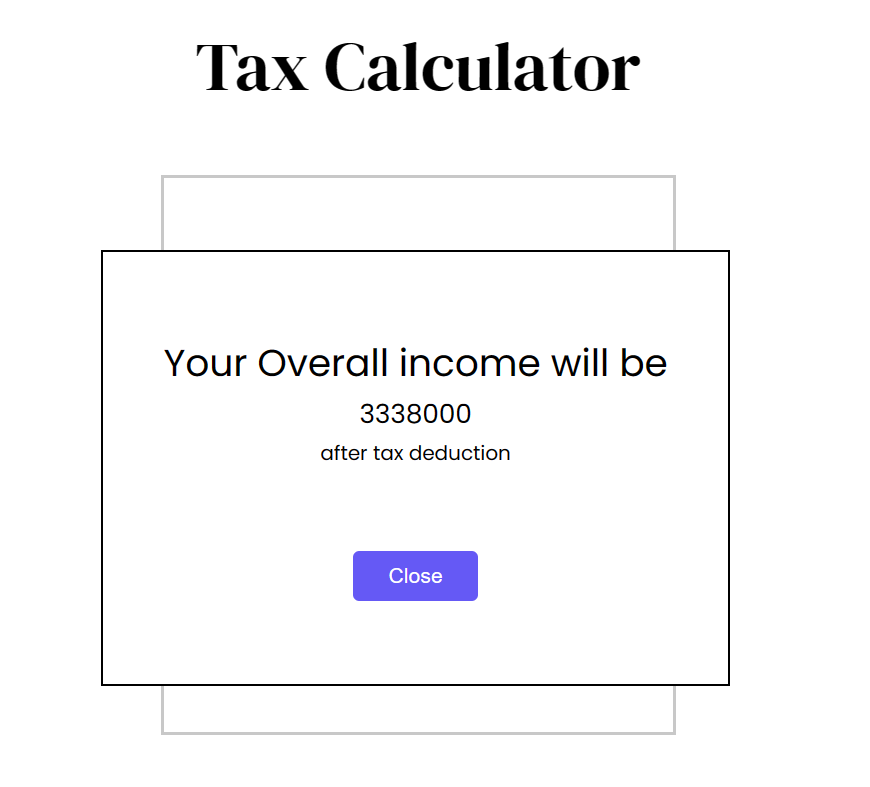

# Tax Calculator Web Application
This is a web application designed to calculate tax based on user input for income and age. The application follows the requirements provided by Fyle for their Web Development Internship Challenge.

## Features
- **Tax Calculation**: Calculates tax based on user input for income and age according to the provided formula.
- **Error Handling**: Highlights errors in input fields and provides tooltips for guidance.
- **Modal Display**: Displays final tax calculation in a modal after submission.
- **Responsive Design**: Ensures the application is usable across different devices and screen sizes.

## Technologies Used
- HTML
- CSS
- JavaScript

## How to Use
1. Clone the repository to your local machine:

    `git clone <repository_link>`

2. Open the index.html file in your web browser.

3. Enter the required details in the form:
   - Gross Annual Income
   - Extra Income
   - Deductions
   - Age
4. Submit the form to calculate tax.

5. Review the modal popup to see the calculated tax.

## Assumptions

- The application assumes that the user will enter numerical values for income, extra income, and deductions.
- All the numbers must be Positive.
- The age dropdown is mandatory, and the user must select one of the provided options before submitting the form.
- The **Gross annual Income** can't be less than **Deduction amount**.

## Screenshots

1. Initial Preview

   

3. Guidance Tooltip

   
  

3.  **Errors**

  - Input Field is Mandatory

    

  - Character input error

    
    

  - Negative Number Input error

    
    

  - Empty Age Group field Error

    
    

  - Annual Income Less than Deduction amount error

    
    

4. All Fields are Correct

   - Input

    

   - output

    

5. Gross Annual Income Less Than 8 lakhs

   - Input
     
    

   - Output
     
    

   

## Contributor

Dhruv Jain

